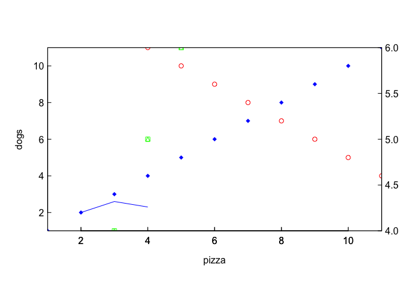

`dinosvg` package version 0.2.0
===============================

### purpose of package

### rendering svgs

create a plot with `gsplot`

``` r
library(gsplot)
```

    ## This information is preliminary or provisional and is subject to revision. It is being provided to meet the need for timely best science. The information has not received final approval by the U.S. Geological Survey (USGS) and is provided on the condition that neither the USGS nor the U.S. Government shall be held liable for any damages resulting from the authorized or unauthorized use of the information. Although this software program has been used by the USGS, no warranty, expressed or implied, is made by the USGS or the U.S. Government as to the accuracy and functioning of the program and related program material nor shall the fact of distribution constitute any such warranty, and no responsibility is assumed by the USGS in connection therewith.

    ## 
    ## Attaching package: 'gsplot'

    ## The following objects are masked from 'package:graphics':
    ## 
    ##     abline, arrows, axis, curve, grid, legend, lines, mtext, par,
    ##     points, polygon, rect, segments, symbols, text, title

``` r
gs <- gsplot() %>% 
  points(y=1:11, x=1:11, 
           col="blue", pch=18, xlab='pizza', ylab='dogs') %>% 
  points(x=4:11, y=11:4, 
           col="red", pch=1) %>% 
  points(3:5,4:6,side=c(1,4), col='green', pch=14, ylab='cats') %>% 
  lines(2:4, c(2,2.6,2.3), col='blue')
gs
```



``` r
library(dinosvg)
```

    ## 
    ## Attaching package: 'dinosvg'

    ## The following object is masked from 'package:grDevices':
    ## 
    ##     svg

``` r
gs <- gsplot() %>% 
  points(y=1:11, x=1:11, 
           col="blue", pch=18, hovertext=paste0('text:',1:11), xlab='pizza', ylab='dogs', 
           id=paste0('point',1:11), 'fill-opacity'='0.3', 'stroke-opacity'=seq(0,1, length.out = 11)) %>% 
  points(x=4:11, y=11:4, 
           col="red", pch=1, hovertext=paste0('text:',11:4)) %>% 
  points(3:5,4:6,side=c(1,4), col='green', hovertext='green', pch=14, ylab='cats') %>% 
  lines(2:4, c(2,2.6,2.3), col='blue')
cat(svg(gs, as.string=TRUE))
```

<svg xmlns="http://www.w3.org/2000/svg" xmlns:xlink="http://www.w3.org/1999/xlink" version="1.1" preserveAspectRatio="xMinYMin meet" viewBox="0 0 432 310">
<style>
.shown, .hidden {
        -webkit-transition: opacity 0.2s ease-in-out;
        -moz-transition: opacity 0.2s ease-in-out;
        -o-transition: opacity 0.2s ease-in-out;
        transition: opacity 0.2s ease-in-out;
    }
  .hidden {
        opacity:0;
  }
</style>
<g id="view-1-2"> <defs> <clipPath id="mask-1-2"> <rect x="59.04" y="59.04" height="177.52" width="342.72"/> </clipPath> </defs> <g id="axes" fill="none" stroke="#000000" stroke-width="1"> <rect x="59.04" y="59.04" height="177.52" width="342.72" id="axes-box"/> <g id="axis-side-1"> <g id="tick-labels" stroke="none" fill="#000000" text-anchor="middle"> <text x="93.312" y="236.56" dy="1.0em">2</text> <text x="161.856" y="236.56" dy="1.0em">4</text> <text x="230.4" y="236.56" dy="1.0em">6</text> <text x="298.944" y="236.56" dy="1.0em">8</text> <text x="367.488" y="236.56" dy="1.0em">10</text> </g> <g id="ticks"> <path d="M 93.312,236.56 v -5"/> <path d="M 161.856,236.56 v -5"/> <path d="M 230.4,236.56 v -5"/> <path d="M 298.944,236.56 v -5"/> <path d="M 367.488,236.56 v -5"/> </g> <g id="axis-label" stroke="none" fill="#000000" text-anchor="middle"> <text x="230.4" y="236.56" dy="2.0em">pizza</text> </g> </g> <g id="axis-side-2"> <g id="tick-labels" stroke="none" fill="#000000" text-anchor="end"> <text x="59.04" y="218.808" dx="-0.33em" dy="0.33em">2</text> <text x="59.04" y="183.304" dx="-0.33em" dy="0.33em">4</text> <text x="59.04" y="147.8" dx="-0.33em" dy="0.33em">6</text> <text x="59.04" y="112.296" dx="-0.33em" dy="0.33em">8</text> <text x="59.04" y="76.792" dx="-0.33em" dy="0.33em">10</text> </g> <g id="ticks"> <path d="M 59.04,218.808 h 5"/> <path d="M 59.04,183.304 h 5"/> <path d="M 59.04,147.8 h 5"/> <path d="M 59.04,112.296 h 5"/> <path d="M 59.04,76.792 h 5"/> </g> <g id="axis-label" stroke="none" fill="#000000" text-anchor="middle"> <text x="59.04" y="147.8" dy="-2.0em" transform="rotate(-90 59.04,147.8)">dogs</text> </g> </g> </g> <g fill="rgb(0,0,255)" clip-path="url(#mask-1-2)" fill-opacity="0.3"> <path d="M 59.04,232.753 L62.847,236.56 L59.04,240.367 L55.233,236.56Z" fill="rgb(0,0,255)" stroke="rgb(0,0,255)" onmouseover="hovertext('text:1',59.04,236.56)" onmouseout="hovertext(' ')" id="point1" stroke-opacity="0"/> <path d="M 93.312,215.001 L97.119,218.808 L93.312,222.615 L89.505,218.808Z" fill="rgb(0,0,255)" stroke="rgb(0,0,255)" onmouseover="hovertext('text:2',93.312,218.808)" onmouseout="hovertext(' ')" id="point2" stroke-opacity="0.1"/> <path d="M 127.584,197.249 L131.391,201.056 L127.584,204.863 L123.777,201.056Z" fill="rgb(0,0,255)" stroke="rgb(0,0,255)" onmouseover="hovertext('text:3',127.584,201.056)" onmouseout="hovertext(' ')" id="point3" stroke-opacity="0.2"/> <path d="M 161.856,179.497 L165.663,183.304 L161.856,187.111 L158.049,183.304Z" fill="rgb(0,0,255)" stroke="rgb(0,0,255)" onmouseover="hovertext('text:4',161.856,183.304)" onmouseout="hovertext(' ')" id="point4" stroke-opacity="0.3"/> <path d="M 196.128,161.745 L199.935,165.552 L196.128,169.359 L192.321,165.552Z" fill="rgb(0,0,255)" stroke="rgb(0,0,255)" onmouseover="hovertext('text:5',196.128,165.552)" onmouseout="hovertext(' ')" id="point5" stroke-opacity="0.4"/> <path d="M 230.4,143.993 L234.207,147.8 L230.4,151.607 L226.593,147.8Z" fill="rgb(0,0,255)" stroke="rgb(0,0,255)" onmouseover="hovertext('text:6',230.4,147.8)" onmouseout="hovertext(' ')" id="point6" stroke-opacity="0.5"/> <path d="M 264.672,126.241 L268.479,130.048 L264.672,133.855 L260.865,130.048Z" fill="rgb(0,0,255)" stroke="rgb(0,0,255)" onmouseover="hovertext('text:7',264.672,130.048)" onmouseout="hovertext(' ')" id="point7" stroke-opacity="0.6"/> <path d="M 298.944,108.489 L302.751,112.296 L298.944,116.103 L295.137,112.296Z" fill="rgb(0,0,255)" stroke="rgb(0,0,255)" onmouseover="hovertext('text:8',298.944,112.296)" onmouseout="hovertext(' ')" id="point8" stroke-opacity="0.7"/> <path d="M 333.216,90.737 L337.023,94.544 L333.216,98.351 L329.409,94.544Z" fill="rgb(0,0,255)" stroke="rgb(0,0,255)" onmouseover="hovertext('text:9',333.216,94.544)" onmouseout="hovertext(' ')" id="point9" stroke-opacity="0.8"/> <path d="M 367.488,72.985 L371.295,76.792 L367.488,80.599 L363.681,76.792Z" fill="rgb(0,0,255)" stroke="rgb(0,0,255)" onmouseover="hovertext('text:10',367.488,76.792)" onmouseout="hovertext(' ')" id="point10" stroke-opacity="0.9"/> <path d="M 401.76,55.233 L405.567,59.04 L401.76,62.847 L397.953,59.04Z" fill="rgb(0,0,255)" stroke="rgb(0,0,255)" onmouseover="hovertext('text:11',401.76,59.04)" onmouseout="hovertext(' ')" id="point11" stroke-opacity="1"/> </g> <g fill="rgb(255,0,0)" clip-path="url(#mask-1-2)"> <circle cx="161.856" cy="59.04" r="2.7" fill="#FFFFFF" fill-opacity="0" stroke="rgb(255,0,0)" onmouseover="hovertext('text:11',161.856,59.04)" onmouseout="hovertext(' ')"/> <circle cx="196.128" cy="76.792" r="2.7" fill="#FFFFFF" fill-opacity="0" stroke="rgb(255,0,0)" onmouseover="hovertext('text:10',196.128,76.792)" onmouseout="hovertext(' ')"/> <circle cx="230.4" cy="94.544" r="2.7" fill="#FFFFFF" fill-opacity="0" stroke="rgb(255,0,0)" onmouseover="hovertext('text:9',230.4,94.544)" onmouseout="hovertext(' ')"/> <circle cx="264.672" cy="112.296" r="2.7" fill="#FFFFFF" fill-opacity="0" stroke="rgb(255,0,0)" onmouseover="hovertext('text:8',264.672,112.296)" onmouseout="hovertext(' ')"/> <circle cx="298.944" cy="130.048" r="2.7" fill="#FFFFFF" fill-opacity="0" stroke="rgb(255,0,0)" onmouseover="hovertext('text:7',298.944,130.048)" onmouseout="hovertext(' ')"/> <circle cx="333.216" cy="147.8" r="2.7" fill="#FFFFFF" fill-opacity="0" stroke="rgb(255,0,0)" onmouseover="hovertext('text:6',333.216,147.8)" onmouseout="hovertext(' ')"/> <circle cx="367.488" cy="165.552" r="2.7" fill="#FFFFFF" fill-opacity="0" stroke="rgb(255,0,0)" onmouseover="hovertext('text:5',367.488,165.552)" onmouseout="hovertext(' ')"/> <circle cx="401.76" cy="183.304" r="2.7" fill="#FFFFFF" fill-opacity="0" stroke="rgb(255,0,0)" onmouseover="hovertext('text:4',401.76,183.304)" onmouseout="hovertext(' ')"/> </g> <g stroke="rgb(0,0,255)" fill="none" clip-path="url(#mask-1-2)"> <path d="M93.312,218.808 127.584,208.157 161.856,213.482"/> </g> </g> <g id="view-1-4"> <defs> <clipPath id="mask-1-4"> <rect x="59.04" y="59.04" height="177.52" width="342.72"/> </clipPath> </defs> <g id="axes" fill="none" stroke="#000000" stroke-width="1"> <rect x="59.04" y="59.04" height="177.52" width="342.72" id="axes-box"/> <g id="axis-side-1"> <g id="tick-labels" stroke="none" fill="#000000" text-anchor="middle"> <text x="93.312" y="236.56" dy="1.0em">2</text> <text x="161.856" y="236.56" dy="1.0em">4</text> <text x="230.4" y="236.56" dy="1.0em">6</text> <text x="298.944" y="236.56" dy="1.0em">8</text> <text x="367.488" y="236.56" dy="1.0em">10</text> </g> <g id="ticks"> <path d="M 93.312,236.56 v -5"/> <path d="M 161.856,236.56 v -5"/> <path d="M 230.4,236.56 v -5"/> <path d="M 298.944,236.56 v -5"/> <path d="M 367.488,236.56 v -5"/> </g> </g> <g id="axis-side-4"> <g id="tick-labels" stroke="none" fill="#000000" text-anchor="begin"> <text x="401.76" y="236.56" dx="0.33em" dy="0.33em">4</text> <text x="401.76" y="192.18" dx="0.33em" dy="0.33em">4.5</text> <text x="401.76" y="147.8" dx="0.33em" dy="0.33em">5</text> <text x="401.76" y="103.42" dx="0.33em" dy="0.33em">5.5</text> <text x="401.76" y="59.04" dx="0.33em" dy="0.33em">6</text> </g> <g id="ticks"> <path d="M 401.76,236.56 h -5"/> <path d="M 401.76,192.18 h -5"/> <path d="M 401.76,147.8 h -5"/> <path d="M 401.76,103.42 h -5"/> <path d="M 401.76,59.04 h -5"/> </g> <g id="axis-label" stroke="none" fill="#000000" text-anchor="middle"> <text x="401.76" y="147.8" dy="2.0em" transform="rotate(-90 401.76,147.8)">cats</text> </g> </g> </g> <g fill="rgb(0,255,0)" clip-path="url(#mask-1-4)"> <path d="M 124.884,233.86 h 5.4 v 5.4 h -5.4 Z M 124.884,239.26 L 127.584,233.86 L 130.284,239.26" fill="#FFFFFF" fill-opacity="0" stroke="rgb(0,255,0)" stroke-linejoin="bevel" onmouseover="hovertext('green',127.584,236.56)" onmouseout="hovertext(' ')"/> <path d="M 159.156,145.1 h 5.4 v 5.4 h -5.4 Z M 159.156,150.5 L 161.856,145.1 L 164.556,150.5" fill="#FFFFFF" fill-opacity="0" stroke="rgb(0,255,0)" stroke-linejoin="bevel" onmouseover="hovertext('green',161.856,147.8)" onmouseout="hovertext(' ')"/> <path d="M 193.428,56.34 h 5.4 v 5.4 h -5.4 Z M 193.428,61.74 L 196.128,56.34 L 198.828,61.74" fill="#FFFFFF" fill-opacity="0" stroke="rgb(0,255,0)" stroke-linejoin="bevel" onmouseover="hovertext('green',196.128,59.04)" onmouseout="hovertext(' ')"/> </g> </g> <text id="tooltip" dx="0.2em" dy="-0.2em" stroke="none" fill="#000000"> </text>
<script type="text/ecmascript"><![CDATA[
function hovertext(text, x, y){
    var tooltip = document.getElementById("tooltip");
    if (x === undefined){
        tooltip.setAttribute("class","hidden");
        tooltip.setAttribute("x",0);
        tooltip.setAttribute("y",0);
        tooltip.firstChild.data = text;
    } else {
        tooltip.setAttribute("x",x);
        tooltip.setAttribute("y",y);
        tooltip.firstChild.data = text;
        tooltip.setAttribute("class","shown");
    }
  }]]></script>
</svg>
